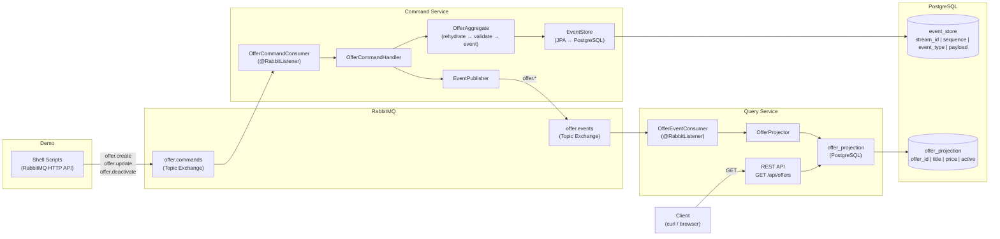

# Architecture — CQRS + Event Sourcing Demo

## Data Flow



## Two Exchanges — Clear Separation

| Exchange | Type | Purpose | Producer | Consumer |
|---|---|---|---|---|
| `offer.commands` | Topic | Inbound commands | Shell scripts | Command Service |
| `offer.events` | Topic | Domain events | Command Service | Query Service |

## Event Sourcing Flow

```mermaid
sequenceDiagram
    participant S as Shell Script
    participant R as RabbitMQ
    participant C as Command Service
    participant DB as PostgreSQL
    participant Q as Query Service

    S->>R: Publish CreateOfferCommand
    R->>C: Deliver to command-service.offer.create queue
    C->>DB: Load events for aggregate (empty)
    C->>C: OfferAggregate.create() → OfferCreatedEvent
    C->>DB: Append event to event_store
    C->>R: Publish OfferCreatedEvent to offer.events
    R->>Q: Deliver to query-service.offer.events queue
    Q->>DB: INSERT into offer_projection
